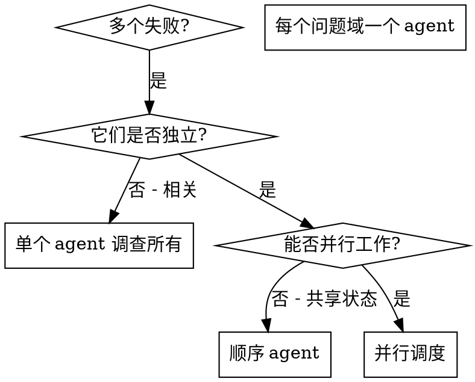

# 并行调度 Agent

## 概述

你将 task 委派给具有隔离上下文的专业 agent。通过精心设计它们的指令和上下文，确保它们专注于自己的 task 并成功完成。它们不应继承你会话的上下文或历史——你需要精确构建它们所需的内容。这也为你自己的协调工作保留了上下文空间。

当你遇到多个不相关的失败（不同的测试文件、不同的子系统、不同的 bug）时，按顺序调查会浪费时间。每次调查都是独立的，可以并行进行。

**核心原则：** 每个独立问题域调度一个 agent。让它们并发工作。

## 何时使用



**使用场景：**
- 3 个以上测试文件因不同根因失败
- 多个子系统独立出错
- 每个问题可以在不了解其他问题上下文的情况下理解
- 调查之间无共享状态

**不使用场景：**
- 失败是相关的（修复一个可能修复其他）
- 需要了解完整系统状态
- Agent 之间会相互干扰

## 模式

### 1. 识别独立域

按出错内容分组：
- 文件 A 测试：Tool 审批流程
- 文件 B 测试：批量完成行为
- 文件 C 测试：中止功能

每个域都是独立的——修复 tool 审批不会影响中止测试。

### 2. 创建专注的 Agent Task

每个 agent 获得：
- **具体范围：** 一个测试文件或子系统
- **明确目标：** 让这些测试通过
- **约束条件：** 不要修改其他代码
- **预期输出：** 发现和修复内容的摘要

### 3. 并行调度

```typescript
// 在 Claude Code / AI 环境中
Task("Fix agent-tool-abort.test.ts failures")
Task("Fix batch-completion-behavior.test.ts failures")
Task("Fix tool-approval-race-conditions.test.ts failures")
// 三个同时并发运行
```

### 4. 审查和整合

当 agent 返回时：
- 阅读每个摘要
- 验证修复不冲突
- 运行完整测试套件
- 整合所有变更

## Agent Prompt 结构

好的 agent prompt 应该：
1. **专注** - 一个明确的问题域
2. **自包含** - 理解问题所需的所有上下文
3. **明确输出要求** - Agent 应该返回什么？

```markdown
修复 src/agents/agent-tool-abort.test.ts 中的 3 个失败测试：

1. "should abort tool with partial output capture" - 期望消息中包含 'interrupted at'
2. "should handle mixed completed and aborted tools" - 快速 tool 被中止而非完成
3. "should properly track pendingToolCount" - 期望 3 个结果但得到 0 个

这些是时序/竞态条件问题。你的 task：

1. 阅读测试文件，理解每个测试验证什么
2. 找到根因——是时序问题还是实际 bug？
3. 通过以下方式修复：
   - 用基于事件的等待替换武断的超时
   - 如果发现中止实现中的 bug 则修复
   - 如果被测行为已变更则调整测试期望

不要只是增加超时时间——找到真正的问题。

返回：你发现了什么以及你修复了什么的摘要。
```

## 常见错误

**❌ 太宽泛：** "修复所有测试" - agent 会迷失方向
**✅ 具体：** "修复 agent-tool-abort.test.ts" - 聚焦的范围

**❌ 无上下文：** "修复竞态条件" - agent 不知道在哪里
**✅ 有上下文：** 粘贴错误消息和测试名称

**❌ 无约束：** Agent 可能重构所有内容
**✅ 有约束：** "不要修改生产代码" 或 "只修复测试"

**❌ 模糊输出：** "修好它" - 你不知道改了什么
**✅ 具体：** "返回根因和变更的摘要"

## 何时不使用

**相关失败：** 修复一个可能修复其他——先一起调查
**需要完整上下文：** 理解需要查看整个系统
**探索性调试：** 你还不知道哪里出了问题
**共享状态：** Agent 会相互干扰（编辑相同文件、使用相同资源）

## 会话中的真实案例

**场景：** 大型重构后 3 个文件共 6 个测试失败

**失败：**
- agent-tool-abort.test.ts：3 个失败（时序问题）
- batch-completion-behavior.test.ts：2 个失败（tool 未执行）
- tool-approval-race-conditions.test.ts：1 个失败（执行计数 = 0）

**决策：** 独立域——中止逻辑与批量完成与竞态条件各自独立

**调度：**
```
Agent 1 → 修复 agent-tool-abort.test.ts
Agent 2 → 修复 batch-completion-behavior.test.ts
Agent 3 → 修复 tool-approval-race-conditions.test.ts
```

**结果：**
- Agent 1：用基于事件的等待替换了超时
- Agent 2：修复了事件结构 bug（threadId 位置错误）
- Agent 3：添加了等待异步 tool 执行完成

**整合：** 所有修复独立，无冲突，完整套件通过

**节省时间：** 3 个问题并行解决 vs 按顺序

## 关键优势

1. **并行化** - 多个调查同时进行
2. **专注** - 每个 agent 范围窄，需要跟踪的上下文少
3. **独立性** - Agent 之间互不干扰
4. **速度** - 3 个问题在 1 个问题的时间内解决

## 验证

Agent 返回后：
1. **审查每个摘要** - 了解改了什么
2. **检查冲突** - Agent 是否编辑了相同代码？
3. **运行完整套件** - 验证所有修复一起工作
4. **抽查** - Agent 可能犯系统性错误

## 实际效果

来自调试会话（2025-10-03）：
- 3 个文件共 6 个失败
- 并行调度了 3 个 agent
- 所有调查并发完成
- 所有修复成功整合
- Agent 变更之间零冲突
