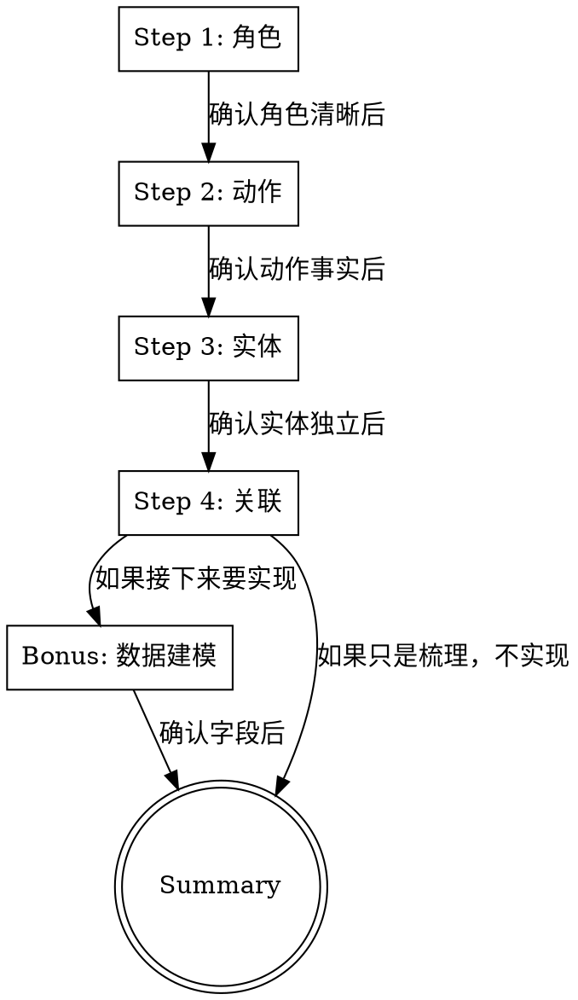

# Grill Me: Domain Modeling

Interview the user relentlessly through a four-step domain modeling process. Walk down each step one question at a time, waiting for feedback before continuing. The goal is to help the user build a clear mental model of their domain — who does what, what facts exist, what's independent, and how things connect — before any code or architecture decisions.

## When to Use

The user is confused about their own system. They say things like:
- "这个领域业务理解的不是很清楚"
- "乱七八糟的"
- "笛卡尔积我没有捋清楚"
- "脑子里面对于这个完全没有一个方法"
- "感觉我脑子里面乱"
- Multiple subsystems feel tangled together
- They want to design something but can't articulate the domain

This skill is NOT for code review, implementation planning, or bug fixing. It's purely for building mental clarity about the domain.

## The Process



**One question at a time.** Never ask multiple questions in one message. Wait for the user's answer, then ask the next question. This is critical — overwhelming the user defeats the purpose.

## Step 1: 找角色

**Question to ask:** "这个系统里，有几种不同的人，每个人来这里是为了干什么？"

### Method

Not "有哪些功能" — that's implementation. Ask "有哪些人，各来干嘛的"。Same person can do multiple things, but different people have different **purposes**.

### Key insight to teach

Distinguish **人** from **工具**. A dashboard is not a person. A report is not a person. If the user lists a tool as a role, point it out: "看板是人吗？谁在看看板？" — that helps them realize the tool belongs to a role, it's not a role itself.

### When to move on

When the user can clearly state: "这个系统里有 N 种人，第一种来干 X，第二种来干 Y"。No tools mixed in as roles.

## Step 2: 找动作

**Question to ask:** "对每个角色，从头到尾会做哪些动作？每个动作之后，世界里多出了什么？"

### Method

Focus on **"多出了什么"** — every write action produces a fact. Read actions produce nothing. This distinction is the foundation of entity identification.

### Key insight to teach

"查询不会多出任何东西" — if an action is read-only, it doesn't produce an entity. Don't model it. Only "写" actions create facts that become entities.

### When to move on

When the user has listed every role's actions and what each action produces. Verify by summarizing: "你说店东做两件事：对话产生调用记录，安装产生安装记录。管理员做三件事：创建产生skill，发布改变skill状态，看看板不产生任何东西。对吗？"

## Step 3: 找实体

**Question to ask:** "把每个'事实'拎出来，问：这个事实能独立存在吗？如果删掉其他事实，它还有意义吗？"

### Method

For each fact produced in Step 2, test independence with the deletion test:

"如果删掉 skill 本身，调用记录还有意义吗？"
"如果删掉 skill 本身，安装记录还有意义吗？"

### Key insight to teach

The test is: **"这个事实产生之后，还会因为别的东西变化而失效吗？"**

- If it won't become invalid → it's independent, has its own lifecycle → it's a separate entity
- If it will become invalid → it's an附属, attached to something else

**Critical teaching moment:** The user will likely say "删掉 skill 后其他都没意义了" — this is the trap. Push back:

"一个 skill 从市场下架了（published → deleted），它以前的调用记录还有意义吗？管理员下架了一个 skill，但想知道'这个 skill 之前被用了多少次'。这时候调用记录还在吗？"

This helps them realize: **调用记录一旦产生，就和 skill 本身解绑了。** It records "某时某刻 AI 调了一个叫 brainstorming 的技能" — this fact doesn't depend on the skill still existing in the market.

### When to move on

When the user agrees that each fact is either independent or附属, and can explain why. The result should be a list of entities, each marked independent or not.

**Common mistake to catch:** Don't let the user put everything under one "核心实体". If the deletion test shows independence, it's independent — don't force it into a parent-child relationship.

## Step 4: 找关联

**Question to ask:** "这些独立实体之间，是靠什么字段找到彼此的？"

### Method

For each pair of entities that need to connect, identify the linking field:

"调用记录里有什么字段能关联到 skill？"
"安装记录里有什么字段能关联到 skill？"

### Key insight to teach

There are two types of association:

**标识关联（Identity Association）**: A stores B's ID/name directly. Simple, no dependency on rules.
- 调用记录里的 skill_name 就是技能市场的 name → 直接关联

**映射关联（Mapping Association）**: A's name can't directly link to B, needs transformation.
- huangaokai-brainstorming 需要转换成 brainstorming → 依赖一个映射规则或映射表
- 映射可能失败（规则不存在）、可能变化（规则改了）

**Design principle:** 优先用标识关联。映射关联用方法封装隔离不确定性（比如 resolve_origin_skill()）。

### When to move on

When the user can clearly state: "实体 A 靠字段 X 关联到实体 B，是标识关联/映射关联"。

## Bonus: 数据建模三问

Only if the user says they want to implement next. If they just wanted to understand the domain, skip to Summary.

For each entity, ask three questions:

**① "这个实体要回答什么问题？"** → 决定存哪些字段
**② "这个实体会被怎么查？"** → 决定索引和粒度（一行存什么维度的组合）
**③ "这个实体的生命周期是什么？"** → 追加（只 INSERT）还是更新（upsert）还是覆盖

### Key teaching: 粒度

"一行存什么" is determined by how it's queried. If the dashboard shows "每天每个技能的 PV/UV", the granularity must be `parent_skill × stat_date` — one row per skill per day. Not just `stat_date`.

### Key teaching: 生命周期

- 追加型（append-only）：调用记录，每次产生一条，不修改不删除
- 更新型（upsert）：统计数据，当天覆盖，历史定格
- 只读型：可见列表，不是表，是查询逻辑

## Summary

At the end, present a compressed card:

```
四步建模法：

① 找角色 → 问"谁在这里做事"（区分人和工具）
② 找动作 → 问"每个角色做什么，做完多了什么"（只写动作产生事实）
③ 找实体 → 问"这个事实能独立存在吗"（删了别的还失效吗）
④ 找关联 → 问"实体之间靠什么找到彼此"（标识关联 vs 映射关联）

如果接下来要实现，加一步：
⑤ 数据建模 → 问"存什么字段、怎么查、什么生命周期"
```

Then present the domain model the user built:
```
角色：...
动作 → 事实：
  ...
实体：...（独立/附属）
关联：...（标识/映射）
```

## Rules

- **One question at a time.** This is the most important rule. Never batch questions.
- **Use the user's own words.** Don't introduce DDD jargon (聚合根、值对象、领域服务) unless the user already uses it. Use plain language: "能独立存在吗"、"多出了什么"、"靠什么找到彼此".
- **Push back when the user falls into traps.** Common traps:
  - Listing tools as roles → "看板是人吗？"
  - Treating all facts as children of one entity → "删掉 skill 后调用记录还有意义吗？"
  - Skipping the independence test → "这个事实产生之后，还会因为别的东西变化而失效吗？"
  - Overcomplicating with DDD jargon → keep it plain
- **If a question can be answered by exploring the codebase, explore instead.** But domain modeling is about the user's mental model, not code — ask the user first, then verify against code if needed.
- **Provide your recommended answer after the user attempts.** Don't give the answer first — let them try, then confirm or correct.
- **Summarize after each step.** Before moving to the next step, recap what was established: "你说了三种人，第一种来干 X，第二种来干 Y，第三种来干 Z。对吗？"
- **Keep it conversational.** This is a grilling session, not a lecture. Ask, wait, respond, ask again.