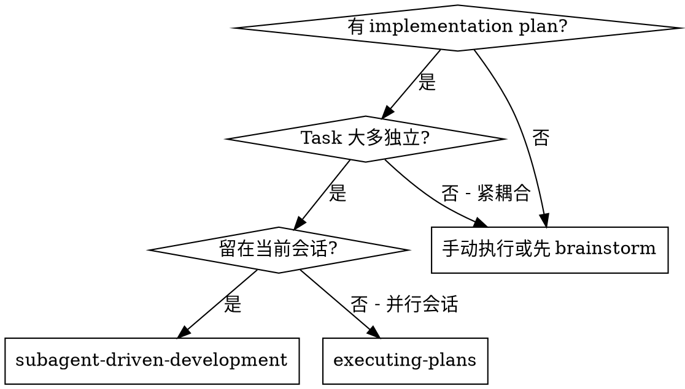
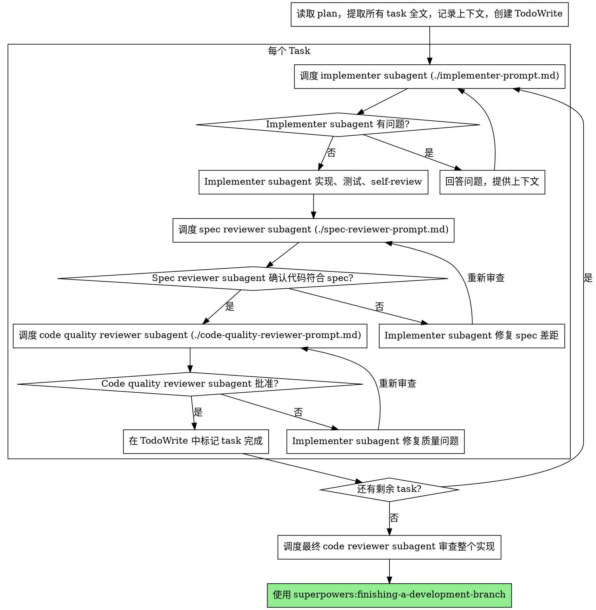

# Subagent 驱动开发

通过为每个 task 调度新的 subagent 来执行 plan，每个 task 完成后进行两阶段审查：先检查 spec 合规性，再检查代码质量。

**为什么用 subagent：** 你将 task 委派给具有隔离上下文的专业 agent。通过精心设计它们的指令和上下文，确保它们专注于自己的 task 并成功完成。它们不应继承你会话的上下文或历史——你需要精确构建它们所需的内容。这也为你自己的协调工作保留了上下文空间。

**核心原则：** 每个 task 使用新 subagent + 两阶段审查（spec 然后质量）= 高质量、快速迭代

**持续执行：** 不要在 task 之间暂停向用户确认。不停顿地执行 plan 中的所有 task。停止的唯一理由是：你无法解决的 BLOCKED 状态、真正阻碍进展的歧义、或所有 task 已完成。"要继续吗？"的提示和进度摘要会浪费他们的时间——他们让你执行 plan，那就执行。

## 何时使用



**vs. Executing Plans（并行会话）：**
- 同一会话（无上下文切换）
- 每个 task 使用新 subagent（无上下文污染）
- 每个 task 后两阶段审查：先 spec 合规性，再代码质量
- 更快的迭代（task 之间无人工介入）

## 流程



## 模型选择

为每个角色使用能胜任的最低能力模型，以节省成本并提高速度。

**机械性实现 task**（独立函数、明确 spec、1-2 个文件）：使用快速、便宜的模型。当 plan 定义明确时，大多数实现 task 都是机械性的。

**集成和判断型 task**（多文件协调、模式匹配、调试）：使用标准模型。

**架构、design 和审查 task**：使用最强大的可用模型。

**Task 复杂度信号：**
- 涉及 1-2 个文件且有完整 spec → 便宜模型
- 涉及多个文件且有集成关注点 → 标准模型
- 需要 design 判断或广泛的代码库理解 → 最强大模型

## 处理 Implementer 状态

Implementer subagent 报告四种状态之一。按以下方式处理：

**DONE：** 进入 spec 合规性审查。

**DONE_WITH_CONCERNS：** Implementer 完成了工作但标记了疑虑。在继续前阅读这些疑虑。如果疑虑涉及正确性或范围，在审查前解决。如果只是观察（如"这个文件变大了"），记录并继续审查。

**NEEDS_CONTEXT：** Implementer 需要未提供的信息。提供缺失的上下文并重新调度。

**BLOCKED：** Implementer 无法完成 task。评估阻塞原因：
1. 如果是上下文问题，提供更多上下文并用相同模型重新调度
2. 如果 task 需要更强的推理能力，用更强大的模型重新调度
3. 如果 task 太大，拆分为更小的部分
4. 如果 plan 本身有误，向用户上报

**绝不**忽略上报或在不做任何改变的情况下强制同一模型重试。如果 implementer 说卡住了，就需要做出改变。

## Prompt 模板

- `./implementer-prompt.md` - 调度 implementer subagent
- `./spec-reviewer-prompt.md` - 调度 spec 合规性审查 subagent
- `./code-quality-reviewer-prompt.md` - 调度代码质量审查 subagent

## 示例工作流

```
You: 我将使用 Subagent 驱动开发来执行这个 plan。

[读取 plan 文件一次：docs/harness/plans/feature-plan.md]
[提取所有 5 个 task 的全文和上下文]
[创建包含所有 task 的 TodoWrite]

Task 1: Hook 安装脚本

[获取 Task 1 文本和上下文（已提取）]
[调度实现 subagent，提供完整 task 文本 + 上下文]

Implementer: "开始之前——hook 应该安装在用户级别还是系统级别？"

You: "用户级别（~/.config/superpowers/hooks/）"

Implementer: "明白了。正在实现..."
[稍后] Implementer:
  - 实现了 install-hook 命令
  - 添加了测试，5/5 通过
  - Self-review: 发现遗漏了 --force 标志，已添加

[调度 spec 合规性审查]
Spec reviewer: ✅ 符合 spec - 所有需求满足，无多余内容

[获取 git SHA，调度代码质量审查]
Code reviewer: 优点：测试覆盖好，干净。问题：无。批准。

[标记 Task 1 完成]

Task 2: 恢复模式

[获取 Task 2 文本和上下文（已提取）]
[调度实现 subagent，提供完整 task 文本 + 上下文]

Implementer: [无问题，直接执行]
Implementer:
  - 添加了 verify/repair 模式
  - 8/8 测试通过
  - Self-review: 一切正常

[调度 spec 合规性审查]
Spec reviewer: ❌ 问题：
  - 缺失：进度报告（spec 要求"每 100 项报告一次"）
  - 多余：添加了 --json 标志（未要求）

[Implementer 修复问题]
Implementer: 移除了 --json 标志，添加了进度报告

[Spec reviewer 重新审查]
Spec reviewer: ✅ 现在符合 spec

[调度代码质量审查]
Code reviewer: 优点：扎实。问题（重要）：魔法数字（100）

[Implementer 修复]
Implementer: 提取了 PROGRESS_INTERVAL 常量

[Code reviewer 重新审查]
Code reviewer: ✅ 批准

[标记 Task 2 完成]

...

[所有 task 完成后]
[调度最终 code-reviewer]
Final reviewer: 所有需求满足，可以合并

完成！
```

## 优势

**vs. 手动执行：**
- Subagent 自然遵循 TDD
- 每个 task 全新上下文（不会混淆）
- 并行安全（subagent 互不干扰）
- Subagent 可以提问（工作前和工作中都可以）

**vs. Executing Plans：**
- 同一会话（无需交接）
- 持续推进（无需等待）
- 审查检查点自动化

**效率提升：**
- 无文件读取开销（控制器提供全文）
- 控制器精确策划所需上下文
- Subagent 预先获得完整信息
- 问题在工作开始前就浮现（而非之后）

**质量关卡：**
- Self-review 在交接前发现问题
- 两阶段审查：spec 合规性，然后代码质量
- 审查循环确保修复确实有效
- Spec 合规性防止过度/不足构建
- 代码质量确保实现质量

**成本：**
- 更多 subagent 调用（每个 task 需要 implementer + 2 个 reviewer）
- 控制器做更多准备工作（预先提取所有 task）
- 审查循环增加迭代
- 但能早期发现问题（比后期调试更便宜）

## Red Flags

**绝不：**
- 在未获得用户明确同意的情况下在 main/master 分支上开始实现
- 跳过审查（spec 合规性或代码质量）
- 带着未修复的问题继续
- 并行调度多个实现 subagent（会冲突）
- 让 subagent 读取 plan 文件（改为提供全文）
- 跳过场景设定上下文（subagent 需要理解 task 的定位）
- 忽略 subagent 的问题（在让它们继续前先回答）
- 在 spec 合规性上接受"差不多"（spec reviewer 发现问题 = 未完成）
- 跳过审查循环（reviewer 发现问题 = implementer 修复 = 再次审查）
- 让 implementer 的 self-review 替代正式审查（两者都需要）
- **在 spec 合规性 ✅ 之前开始代码质量审查**（顺序错误）
- 在任一审查有未解决问题时就进入下一个 task

**如果 subagent 提问：**
- 清晰完整地回答
- 需要时提供额外上下文
- 不要催促它们进入实现

**如果 reviewer 发现问题：**
- Implementer（同一个 subagent）修复
- Reviewer 再次审查
- 重复直到批准
- 不要跳过重新审查

**如果 subagent 失败 task：**
- 调度修复 subagent 并提供具体指令
- 不要尝试手动修复（上下文污染）

## 集成

**必需的工作流 skill：**
- **superpowers:using-git-worktrees** - 确保隔离工作空间（创建一个或验证现有的）
- **superpowers:writing-plans** - 创建此 skill 执行的 plan
- **superpowers:requesting-code-review** - reviewer subagent 的代码审查模板
- **superpowers:finishing-a-development-branch** - 所有 task 完成后收尾开发

**Subagent 应使用：**
- **superpowers:test-driven-development** - Subagent 对每个 task 遵循 TDD

**替代工作流：**
- **superpowers:executing-plans** - 用于并行会话而非同会话执行
