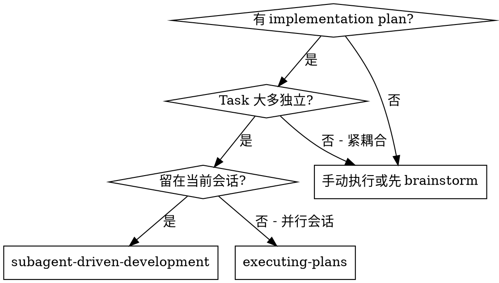

# Subagent 驱动开发

将"写测试"和"写代码"拆给不同 agent，消除"自写自测"偏差。多个 task 并行推进，每个 task 内部走测试先行 → 实现 → 审查的流水线。

**核心原则：** 写测试的人不写代码，写代码的人不审代码。三条流水线并行推进。

**持续执行：** 不要在 task 之间暂停向用户确认。不停顿地执行 plan 中的所有 task。停止的唯一理由是：你无法解决的 BLOCKED 状态、真正阻碍进展的歧义、或所有 task 已完成。

## 何时使用



**vs. Executing Plans（并行会话）：**
- 同一会话（无上下文切换）
- 多个 task 并行推进
- 每个 task 内三条流水线：Test Writer → Implementer → Reviewer
- 写测试的和写代码的是不同 agent（消除自写自测）

## 流程

```dot
digraph process {
    rankdir=TB;
    compound=true;

    subgraph cluster_per_task {
        label="每个 Task（流水线，不可并行）";
        "调度 Test Writer subagent (./test-writer-prompt.md)" [shape=box];
        "Test Writer 有问题?" [shape=diamond];
        "回答问题或修复歧义" [shape=box];
        "Test Writer 写失败测试" [shape=box style=filled fillcolor=#ffcccc];
        "调度 Implementer subagent (./implementer-prompt.md)" [shape=box];
        "Implementer 有问题?" [shape=diamond];
        "Implementer 写代码让测试通过" [shape=box style=filled fillcolor=#ccffcc];
        "调度 Reviewer subagent (./reviewer-prompt.md)" [shape=box];
        "Reviewer 批准?" [shape=diamond];
        "Implementer 修复问题" [shape=box];
        "标记 task 完成" [shape=box];
    }

    "读取 plan，提取所有 task，创建 TodoWrite" [shape=box];
    "所有 task 完成?" [shape=diamond];
    "调度最终 reviewer 审查整体实现" [shape=box];
    "使用 superpowers:finishing-a-development-branch" [shape=box style=filled fillcolor=lightgreen];

    "读取 plan，提取所有 task，创建 TodoWrite" -> "调度 Test Writer subagent (./test-writer-prompt.md)" [lhead=cluster_per_task];
    "调度 Test Writer subagent (./test-writer-prompt.md)" -> "Test Writer 有问题?";
    "Test Writer 有问题?" -> "回答问题或修复歧义" [label="是"];
    "回答问题或修复歧义" -> "调度 Test Writer subagent (./test-writer-prompt.md)";
    "Test Writer 有问题?" -> "Test Writer 写失败测试" [label="否"];
    "Test Writer 写失败测试" -> "调度 Implementer subagent (./implementer-prompt.md)";
    "调度 Implementer subagent (./implementer-prompt.md)" -> "Implementer 有问题?";
    "Implementer 有问题?" -> "回答问题或修复歧义" [label="是"];
    "回答问题或修复歧义" -> "调度 Implementer subagent (./implementer-prompt.md)";
    "Implementer 有问题?" -> "Implementer 写代码让测试通过" [label="否"];
    "Implementer 写代码让测试通过" -> "调度 Reviewer subagent (./reviewer-prompt.md)";
    "调度 Reviewer subagent (./reviewer-prompt.md)" -> "Reviewer 批准?";
    "Reviewer 批准?" -> "Implementer 修复问题" [label="否"];
    "Implementer 修复问题" -> "调度 Reviewer subagent (./reviewer-prompt.md)" [label="重新审查"];
    "Reviewer 批准?" -> "标记 task 完成" [label="是"];
    "标记 task 完成" -> "所有 task 完成?";
    "所有 task 完成?" -> "调度 Test Writer subagent (./test-writer-prompt.md)" [label="否" ltail=cluster_per_task];
    "所有 task 完成?" -> "调度最终 reviewer 审查整体实现" [label="是"];
    "调度最终 reviewer 审查整体实现" -> "使用 superpowers:finishing-a-development-branch";
}
```

### 并行推进策略

**Task 之间可以并行，但每个 Task 内部是流水线（不可并行）。**

控制器应在同一轮中 dispatch 所有 task 的 Test Writer（它们只写测试文件，不会冲突）。当某个 Task 的 Test Writer 完成后，立即 dispatch 该 Task 的 Implementer——不要等其他 Task 的 Test Writer。同理，Implementer 完成后立即 dispatch Reviewer。

```
轮次 1（并行）:
  Task 1: Test Writer₁ ████████░░░░
  Task 2: Test Writer₂ ████████████
  Task 3: Test Writer₃ ██████░░░░░░

轮次 2（Task 3 的 TW 先完成，先启动 IM）:
  Task 1: Test Writer₁ ████████░░░░
  Task 2: Test Writer₂ ████████████
  Task 3:             Implementer₃ ████░░░░

轮次 3（Task 1 也完成，启动 IM；Task 2 刚完成）:
  Task 1:             Implementer₁ ██████░░
  Task 2:             Implementer₂ ████░░░░
  Task 3:                          Reviewer₃ ██░░
```

**安全规则：**
- Test Writer 之间可以并行 — 它们只创建测试文件，互不冲突
- Implementer 之间可以并行 — 当 plan 确保不同 task 修改不同文件时
- 如果两个 Task 可能修改同一文件，必须串行（先完成一个再开始另一个的 Implementer）
- Reviewer 只读不改 — 始终可以并行

## 为什么拆开 Test Writer 和 Implementer

| 旧模型 | 新模型 |
|--------|--------|
| Implementer 自己写测试自己写代码 | Test Writer 写测试，Implementer 写代码 |
| 测试受实现偏见影响 | 测试来自需求，不受实现污染 |
| "测试通过了"可能是测试太弱 | 测试质量由 Reviewer 独立检查 |
| TDD 红绿循环依赖 self-discipline | Test Writer 强制执行 RED（必须失败） |

**Test Writer 的工作：**
1. 读取 plan 中的 task 需求
2. 写失败的单元测试（只测试行为，不测试实现）
3. 验证测试确实失败（TDD RED）
4. 不写任何实现代码

**Implementer 的工作：**
1. 拿到 Test Writer 写的失败测试
2. 写最少代码让所有测试通过（TDD GREEN）
3. 不修改测试（除非测试本身有 bug，需上报）
4. 不写新测试（那是 Test Writer 的事）

**Reviewer 的工作（三合一）：**
1. **Spec 合规** — 实现是否完整覆盖需求？有没有多余功能？
2. **代码质量** — 代码干净吗？有安全问题吗？遵循项目规范吗？
3. **测试质量** — 测试覆盖了边界情况吗？测试的是行为还是实现？有没有遗漏的测试场景？

## 模型选择

为每个角色使用能胜任的最低能力模型，以节省成本并提高速度。

| 角色 | 模型要求 | 原因 |
|------|---------|------|
| Test Writer | 标准模型 | 需要理解需求并设计测试场景 |
| Implementer | 便宜模型（机械性 task）/ 标准模型（复杂 task） | 明确的输入（失败测试）→ 输出（通过代码） |
| Reviewer | 最强大模型 | 需要多维度判断（spec + 质量 + 测试） |

## 处理 Subagent 状态

每个 subagent 报告四种状态之一：

**DONE：** 进入下一步（Test Writer → Implementer → Reviewer）。

**DONE_WITH_CONCERNS：** 完成了但标记了疑虑。阅读疑虑后在继续前解决。

**NEEDS_CONTEXT：** 需要未提供的信息。提供上下文并重新调度。

**BLOCKED：** 无法完成。评估原因：
1. 上下文不足 → 提供更多上下文，同模型重试
2. 需要更强推理 → 升级模型重试
3. Task 太大 → 拆分
4. Plan 有误 → 向用户上报

**绝不**忽略上报或不做改变就重试。

## Prompt 模板

- `./test-writer-prompt.md` — 调度 Test Writer subagent（新）
- `./implementer-prompt.md` — 调度 Implementer subagent（已更新：不再写测试）
- `./reviewer-prompt.md` — 调度 Reviewer subagent（新：三合一审查）

## 示例工作流

```
You: 我将使用 Subagent 驱动开发来执行这个 plan。

[读取 plan 文件：docs/harness/plan/feature-plan.md]
[提取所有 3 个 task 的全文和上下文]
[创建 TodoWrite]

=== 阶段 1：并行启动所有 Test Writer ===

Task 1 Test Writer: "需求明确，开始写测试..."
  写入了 3 个测试，全部 FAIL（预期行为）
  报告: DONE, 3 测试失败（正确），覆盖了正常路径和空输入

Task 2 Test Writer: "需求明确，开始写测试..."
  写入了 4 个测试，全部 FAIL
  报告: DONE, 4 测试失败（正确）

Task 3 Test Writer: "plan 里没有说明错误格式，用 JSON 还是纯文本？"
  You: "JSON，{error: string} 格式"
Task 3 Test Writer: "明白。写测试中..."
  写入了 5 个测试，全部 FAIL
  报告: DONE, 5 测试失败（正确），包含错误格式边界

=== 阶段 2：Implementer 各自启动 ===

Task 1 Implementer: [看到 3 个失败测试]
  实现了核心逻辑，3/3 测试通过
  报告: DONE

Task 2 Implementer: [看到 4 个失败测试]
  实现了功能，4/4 测试通过
  报告: DONE

Task 3 Implementer: [看到 5 个失败测试]
  实现中... 5/5 测试通过
  报告: DONE_WITH_CONCERNS — 有个边界情况可能不够严谨

=== 阶段 3：Reviewer 各自审查 ===

Task 1 Reviewer:
  ✅ Spec 合规：完整覆盖
  ✅ 代码质量：干净
  ⚠️ 测试质量：缺少并发场景测试
  结论：让 Test Writer 补一个并发测试

Task 1 Test Writer（补充）:
  补了并发场景测试 → FAIL（实现没处理）
Task 1 Implementer（修复）:
  添加了锁机制 → 测试通过
Task 1 Reviewer（再审）:
  ✅ 全部通过

Task 2 Reviewer:
  ✅ 全部通过

Task 3 Reviewer:
  ✅ Spec 合规
  ⚠️ 代码质量：硬编码超时时间
  ✅ 测试质量：覆盖充分
  结论：让 Implementer 提取常量

Task 3 Implementer（修复）:
  提取了 TIMEOUT_MS 常量
Task 3 Reviewer（再审）:
  ✅ 通过

=== 所有 Task 完成 ===

[调度最终 reviewer]
Final reviewer: ✅ 所有需求满足，可以合并

[使用 finishing-a-development-branch]
完成！
```

## 优势

**vs. 旧模型（一人包办）：**
- 测试不受实现偏见影响（Test Writer 不知道实现长什么样）
- Reviewer 能独立判断测试质量（不是 Implementer 写的，不用给面子）
- TDD RED 强制执行（Test Writer 验证测试失败才算完成）
- Task 之间并行，速度快

**vs. 旧模型（两阶段审查）：**
- Reviewer 三合一，一次审查覆盖三个维度，减少 subagent 调度次数
- 不再有"先等 spec 过了再审代码"的串行等待

## Red Flags

**绝不：**
- 在未获得用户明确同意的情况下在 main/master 分支上开始实现
- 让 Implementer 写测试（测试是 Test Writer 的事）
- 让 Test Writer 写实现代码
- 跳过任何一步（Test Writer → Implementer → Reviewer）
- 让 Implementer 的 self-review 替代 Reviewer 审查
- 两个 Implementer 同时修改同一个文件（会冲突）
- 跳过 Review → Fix → Re-Review 循环
- 在 Reviewer 有未解决问题时标记 task 完成

**如果 subagent 提问：**
- 清晰完整地回答
- 需要时提供额外上下文
- 不要催促它们

**如果 Reviewer 发现问题：**
- Implementer 修复（不改测试）
- 如果是测试质量问题，Test Writer 补充测试 → Implementer 适配
- Reviewer 再次审查
- 重复直到批准

**如果 Implementer 觉得测试有问题：**
- Implementer 不能擅自改测试
- 上报给控制器，控制器判断是否需要 Test Writer 修正
- 如果测试确实有 bug（不是行为争议），Test Writer 修复

## 集成

**必需的工作流 skill：**
- **superpowers:using-git-worktrees** — 确保隔离工作空间
- **superpowers:writing-plans** — 创建此 skill 执行的 plan
- **superpowers:finishing-a-development-branch** — 所有 task 完成后收尾

**Subagent 应使用：**
- **superpowers:test-driven-development** — Test Writer 和 Implementer 遵循 TDD

**替代工作流：**
- **superpowers:executing-plans** — 用于并行会话而非同会话执行
