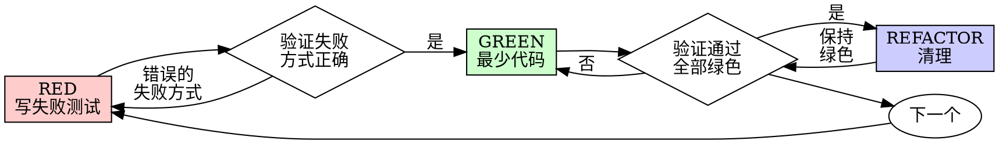

# 测试驱动开发（TDD）

## 概述

先写测试。看它失败。写最少代码使其通过。

**核心原则：** 如果你没有看到测试失败，你就不知道它是否测试了正确的东西。

**违反规则的形式就是违反规则的精神。**

## 何时使用

**始终：**
- 新 feature
- Bug 修复
- 重构
- 行为变更

**例外（需征得用户同意）：**
- 一次性原型
- 生成的代码
- 配置文件

想着"就这一次跳过 TDD"？停下来。那是合理化借口。

## 铁律

```
没有失败测试就不能写生产代码
```

在测试之前写了代码？删掉它。重新开始。

**无例外：**
- 不要保留它作为"参考"
- 不要在写测试时"适配"它
- 不要看它
- 删除就是删除

从测试出发重新实现。句号。

## 红-绿-重构



### RED - 写失败测试

写一个最小的测试，展示期望的行为。

<Good>
```typescript
test('retries failed operations 3 times', async () => {
  let attempts = 0;
  const operation = () => {
    attempts++;
    if (attempts < 3) throw new Error('fail');
    return 'success';
  };

  const result = await retryOperation(operation);

  expect(result).toBe('success');
  expect(attempts).toBe(3);
});
```
清晰的名称，测试真实行为，一件事
</Good>

<Bad>
```typescript
test('retry works', async () => {
  const mock = jest.fn()
    .mockRejectedValueOnce(new Error())
    .mockRejectedValueOnce(new Error())
    .mockResolvedValueOnce('success');
  await retryOperation(mock);
  expect(mock).toHaveBeenCalledTimes(3);
});
```
模糊的名称，测试的是 mock 而非代码
</Bad>

**要求：**
- 一个行为
- 清晰的名称
- 真实代码（除非不得已否则不用 mock）

### 验证 RED - 看它失败

**强制。绝不跳过。**

```bash
npm test path/to/test.test.ts
```

确认：
- 测试失败（不是报错）
- 失败消息符合预期
- 因 feature 缺失而失败（不是拼写错误）

**测试通过了？** 你在测试已有行为。修复测试。

**测试报错了？** 修复错误，重新运行直到它以正确方式失败。

### GREEN - 最少代码

写最简单的代码使测试通过。

<Good>
```typescript
async function retryOperation<T>(fn: () => Promise<T>): Promise<T> {
  for (let i = 0; i < 3; i++) {
    try {
      return await fn();
    } catch (e) {
      if (i === 2) throw e;
    }
  }
  throw new Error('unreachable');
}
```
刚好使测试通过
</Good>

<Bad>
```typescript
async function retryOperation<T>(
  fn: () => Promise<T>,
  options?: {
    maxRetries?: number;
    backoff?: 'linear' | 'exponential';
    onRetry?: (attempt: number) => void;
  }
): Promise<T> {
  // YAGNI
}
```
过度工程
</Bad>

不要添加 feature、重构其他代码、或超出测试范围进行"改进"。

### 验证 GREEN - 看它通过

**强制。**

```bash
npm test path/to/test.test.ts
```

确认：
- 测试通过
- 其他测试仍然通过
- 输出干净（无错误、无警告）

**测试失败了？** 修复代码，不是测试。

**其他测试失败了？** 立即修复。

### REFACTOR - 清理

仅在绿色之后：
- 消除重复
- 改进命名
- 提取辅助函数

保持测试绿色。不要添加行为。

### 重复

为下一个 feature 写下一个失败测试。

## 好的测试

| 质量 | 好 | 坏 |
|---------|------|-----|
| **最小** | 一件事。名称中有"和"？拆分它。 | `test('validates email and domain and whitespace')` |
| **清晰** | 名称描述行为 | `test('test1')` |
| **展示意图** | 展示期望的 API | 掩盖代码应该做什么 |

## 为什么顺序重要

**"我先写完再写测试验证"**

后写的测试会直接通过。立即通过什么也证明不了：
- 可能测试了错误的东西
- 可能测试了实现而非行为
- 可能遗漏了你没想到的边界情况
- 你从未看到它捕获 bug

测试先行迫使你看到测试失败，证明它确实在测试某些东西。

**"我已经手动测试了所有边界情况"**

手动测试是随意的。你以为测试了所有情况但是：
- 没有测试记录
- 代码变更后无法重新运行
- 压力下容易遗漏
- "我试的时候能用" ≠ 全面

自动化测试是系统化的。每次以相同方式运行。

**"删除 X 小时的工作太浪费了"**

沉没成本谬误。时间已经过去了。你现在的选择：
- 删除并用 TDD 重写（再花 X 小时，高信心）
- 保留并后加测试（30 分钟，低信心，可能有 bug）

"浪费"的是保留你无法信任的代码。没有真正测试保护的可用代码是技术债。

**"TDD 太教条了，务实的做法是灵活变通"**

TDD 就是务实的：
- 在提交前发现 bug（比之后调试更快）
- 防止回归（测试立即捕获破坏）
- 记录行为（测试展示如何使用代码）
- 支持重构（自由修改，测试捕获破坏）

"务实的"捷径 = 在生产环境调试 = 更慢。

**"后写测试也能达到同样目标——重要的是精神不是仪式"**

不对。后写测试回答"这做了什么？"测试先行回答"这应该做什么？"

后写测试受你的实现偏见影响。你测试的是你构建的东西，而非需求。你验证的是你记得的边界情况，而非发现的。

测试先行强制在实现前发现边界情况。后写测试假设你记住了所有情况（你没有）。

30 分钟后写测试 ≠ TDD。你得到了覆盖率，失去了测试有效性的证明。

## 常见的合理化借口

| 借口 | 现实 |
|--------|---------|
| "太简单不需要测试" | 简单代码也会出错。测试只需 30 秒。 |
| "我之后再写测试" | 测试立即通过什么也证明不了。 |
| "后写测试也能达到同样目标" | 后写测试 = "这做了什么？" 测试先行 = "这应该做什么？" |
| "已经手动测试过了" | 随意 ≠ 系统化。无记录，无法重新运行。 |
| "删除 X 小时工作太浪费" | 沉没成本谬误。保留未验证的代码是技术债。 |
| "保留作参考，然后先写测试" | 你会适配它。那就是后写测试。删除就是删除。 |
| "需要先探索一下" | 可以。丢弃探索结果，用 TDD 重新开始。 |
| "测试难写 = design 不清晰" | 听测试的话。难测试 = 难用。 |
| "TDD 会拖慢我" | TDD 比调试更快。务实 = 测试先行。 |
| "手动测试更快" | 手动无法证明边界情况。每次变更你都要重新测试。 |
| "现有代码没有测试" | 你在改进它。为现有代码添加测试。 |

## Red Flags - 停下来重新开始

- 在测试之前写代码
- 实现之后才写测试
- 测试立即通过
- 无法解释为什么测试失败
- 测试"以后"再加
- 合理化"就这一次"
- "我已经手动测试过了"
- "后写测试也能达到同样目的"
- "重要的是精神不是仪式"
- "保留作参考"或"适配现有代码"
- "已经花了 X 小时，删除太浪费"
- "TDD 太教条，我是在务实"
- "这次不同因为..."

**以上所有意味着：删除代码。用 TDD 重新开始。**

## 示例：Bug 修复

**Bug：** 空邮箱被接受

**RED**
```typescript
test('rejects empty email', async () => {
  const result = await submitForm({ email: '' });
  expect(result.error).toBe('Email required');
});
```

**验证 RED**
```bash
$ npm test
FAIL: expected 'Email required', got undefined
```

**GREEN**
```typescript
function submitForm(data: FormData) {
  if (!data.email?.trim()) {
    return { error: 'Email required' };
  }
  // ...
}
```

**验证 GREEN**
```bash
$ npm test
PASS
```

**REFACTOR**
如需要，为多个字段提取验证逻辑。

## 验证清单

在标记工作完成之前：

- [ ] 每个新函数/方法都有测试
- [ ] 在实现之前看过每个测试失败
- [ ] 每个测试因预期原因失败（feature 缺失，不是拼写错误）
- [ ] 为每个测试写了最少代码
- [ ] 所有测试通过
- [ ] 输出干净（无错误、无警告）
- [ ] 测试使用真实代码（只在不可避免时用 mock）
- [ ] 覆盖了边界情况和错误情况

无法勾选所有选项？你跳过了 TDD。重新开始。

## 卡住时

| 问题 | 解决方案 |
|---------|----------|
| 不知道怎么测试 | 写出期望的 API。先写断言。向用户求助。 |
| 测试太复杂 | Design 太复杂。简化接口。 |
| 必须 mock 所有东西 | 代码耦合太紧。使用依赖注入。 |
| 测试设置庞大 | 提取辅助函数。仍然复杂？简化 design。 |

## 调试集成

发现 bug？写一个复现它的失败测试。遵循 TDD 循环。测试证明修复并防止回归。

绝不在没有测试的情况下修复 bug。

## 测试反模式

添加 mock 或测试工具时，阅读 @testing-anti-patterns.md 以避免常见陷阱：
- 测试 mock 行为而非真实行为
- 在生产类上添加仅测试用的方法
- 在不理解依赖的情况下 mock

## 最终规则

```
生产代码 → 必须有测试且先失败
否则 → 不是 TDD
```

无用户许可不得有例外。
