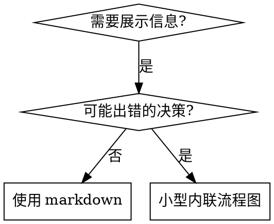

# 编写 Skills

## 概述

**编写 skill 就是将测试驱动开发应用于流程文档。**

**个人 skill 存放在 agent 特定目录（Claude Code 为 `~/.claude/skills`，Codex 为 `~/.agents/skills/`）**

你编写测试用例（带 subagent 的压力场景），看它们失败（基线行为），编写 skill（文档），看测试通过（agent 遵守），然后重构（堵住漏洞）。

**核心原则：** 如果你没有看到 agent 在没有 skill 的情况下失败，你就不知道 skill 是否教了正确的东西。

**必需背景：** 在使用此 skill 之前你必须理解 superpowers:test-driven-development。该 skill 定义了基本的红-绿-重构循环。此 skill 将 TDD 适配到文档。

**官方指导：** Anthropic 官方的 skill 编写最佳实践见 anthropic-best-practices.md。本文档提供补充此 skill 中 TDD 导向方法的额外模式和指南。

## 什么是 Skill？

**Skill** 是经过验证的技术、模式或工具的参考指南。Skill 帮助未来的 Claude 实例找到并应用有效方法。

**Skill 是：** 可复用的技术、模式、工具、参考指南

**Skill 不是：** 关于你曾经如何解决一个问题的叙述

## Skill 的 TDD 映射

| TDD 概念 | Skill 创建 |
|-------------|----------------|
| **测试用例** | 带 subagent 的压力场景 |
| **生产代码** | Skill 文档（SKILL.md） |
| **测试失败（RED）** | Agent 在没有 skill 时违反规则（基线） |
| **测试通过（GREEN）** | Agent 在有 skill 时遵守 |
| **重构** | 在保持合规的同时堵住漏洞 |
| **先写测试** | 在编写 skill 之前运行基线场景 |
| **看它失败** | 记录 agent 使用的确切合理化借口 |
| **最少代码** | 编写针对这些特定违规的 skill |
| **看它通过** | 验证 agent 现在遵守 |
| **重构循环** | 发现新合理化借口 → 堵住 → 重新验证 |

整个 skill 创建过程遵循红-绿-重构。

## 何时创建 Skill

**创建条件：**
- 技术对你来说不是直觉明显的
- 你会跨项目再次参考
- 模式广泛适用（非项目特定）
- 其他人会受益

**不创建条件：**
- 一次性解决方案
- 在其他地方有完善文档的标准实践
- 项目特定约定（放在 CLAUDE.md 中）
- 机械约束（如果可以用正则/验证强制执行，就自动化——将文档留给需要判断的场景）

## Skill 类型

### 技术（Technique）
有具体步骤可遵循的方法（condition-based-waiting、root-cause-tracing）

### 模式（Pattern）
思考问题的方式（flatten-with-flags、test-invariants）

### 参考（Reference）
API 文档、语法指南、工具文档（office docs）

## 目录结构


```
skills/
  skill-name/
    SKILL.md              # 主参考（必需）
    supporting-file.*     # 仅在需要时
```

**扁平命名空间** - 所有 skill 在一个可搜索的命名空间中

**单独文件用于：**
1. **重型参考**（100+ 行）- API 文档、完整语法
2. **可复用工具** - 脚本、工具、模板

**保持内联：**
- 原则和概念
- 代码模式（< 50 行）
- 其他所有内容

## SKILL.md 结构

**Frontmatter（YAML）：**
- 两个必需字段：`name` 和 `description`（所有支持的字段见 [agentskills.io/specification](https://agentskills.io/specification)）
- 总计最多 1024 字符
- `name`：仅使用字母、数字和连字符（无括号、特殊字符）
- `description`：第三人称，仅描述何时使用（而非做什么）
  - 以"Use when..."开头以聚焦触发条件
  - 包含具体症状、场景和上下文
  - **绝不总结 skill 的流程或工作流**（原因见 CSO 部分）
  - 尽量保持在 500 字符以内

```markdown
---
name: Skill-Name-With-Hyphens
description: Use when [具体触发条件和症状]
---

# Skill 名称

## 概述
这是什么？1-2 句话的核心原则。

## 何时使用
[如果决策不明显则用小型内联流程图]

包含症状和使用场景的列表
何时不使用

## 核心模式（用于技术/模式）
前后代码对比

## 快速参考
表格或列表用于快速扫描常见操作

## 实现
简单模式用内联代码
重型参考或可复用工具链接到文件

## 常见错误
出了什么问题 + 修复方法

## 实际效果（可选）
具体结果
```


## Claude 搜索优化（CSO）

**对发现至关重要：** 未来的 Claude 需要找到你的 skill

### 1. 丰富的 Description 字段

**目的：** Claude 阅读 description 来决定为给定 task 加载哪些 skill。让它能回答："我现在应该读这个 skill 吗？"

**格式：** 以"Use when..."开头以聚焦触发条件

**关键：Description = 何时使用，而非 Skill 做什么**

Description 应该仅描述触发条件。不要在 description 中总结 skill 的流程或工作流。

**为什么重要：** 测试发现，当 description 总结 skill 的工作流时，Claude 可能按照 description 而非阅读完整 skill 内容行事。一个说"task 之间的代码审查"的 description 导致 Claude 只做一次审查，尽管 skill 的流程图清楚地显示了两次审查（spec 合规性然后代码质量）。

当 description 改为仅"Use when executing implementation plans with independent tasks"（无工作流总结）时，Claude 正确阅读了流程图并遵循了两阶段审查流程。

**陷阱：** 总结工作流的 description 会创建 Claude 会走的捷径。Skill 正文变成 Claude 跳过的文档。

```yaml
# ❌ 错误：总结工作流 - Claude 可能按此行事而非阅读 skill
description: Use when executing plans - dispatches subagent per task with code review between tasks

# ❌ 错误：太多流程细节
description: Use for TDD - write test first, watch it fail, write minimal code, refactor

# ✅ 正确：仅触发条件，无工作流总结
description: Use when executing implementation plans with independent tasks in the current session

# ✅ 正确：仅触发条件
description: Use when implementing any feature or bugfix, before writing implementation code
```

**内容：**
- 使用具体的触发器、症状和场景来表示此 skill 适用
- 描述*问题*（竞态条件、不一致行为）而非*语言特定症状*（setTimeout、sleep）
- 除非 skill 本身是技术特定的，否则保持触发器技术无关
- 如果 skill 是技术特定的，在触发器中明确说明
- 使用第三人称（注入到系统提示中）
- **绝不总结 skill 的流程或工作流**

```yaml
# ❌ 错误：太抽象、模糊、不包含何时使用
description: For async testing

# ❌ 错误：第一人称
description: I can help you with async tests when they're flaky

# ❌ 错误：提到技术但 skill 并非特定于此
description: Use when tests use setTimeout/sleep and are flaky

# ✅ 正确：以"Use when"开头，描述问题，无工作流
description: Use when tests have race conditions, timing dependencies, or pass/fail inconsistently

# ✅ 正确：技术特定 skill 带明确触发器
description: Use when using React Router and handling authentication redirects
```

### 2. 关键词覆盖

使用 Claude 会搜索的词：
- 错误消息："Hook timed out"、"ENOTEMPTY"、"race condition"
- 症状："flaky"、"hanging"、"zombie"、"pollution"
- 同义词："timeout/hang/freeze"、"cleanup/teardown/afterEach"
- 工具：实际命令、库名、文件类型

### 3. 描述性命名

**使用主动语态，动词优先：**
- ✅ `creating-skills` 而非 `skill-creation`
- ✅ `condition-based-waiting` 而非 `async-test-helpers`

### 4. Token 效率（关键）

**问题：** getting-started 和频繁引用的 skill 会加载到每次对话中。每个 token 都很重要。

**目标字数：**
- getting-started 工作流：每个 <150 字
- 频繁加载的 skill：总计 <200 字
- 其他 skill：<500 字（仍然保持简洁）

**技术：**

**将细节移到工具帮助：**
```bash
# ❌ 错误：在 SKILL.md 中记录所有标志
search-conversations supports --text, --both, --after DATE, --before DATE, --limit N

# ✅ 正确：引用 --help
search-conversations supports multiple modes and filters. Run --help for details.
```

**使用交叉引用：**
```markdown
# ❌ 错误：重复工作流细节
When searching, dispatch subagent with template...
[20 行重复指令]

# ✅ 正确：引用其他 skill
Always use subagents (50-100x context savings). REQUIRED: Use [other-skill-name] for workflow.
```

**压缩示例：**
```markdown
# ❌ 错误：冗长示例（42 字）
用户: "我们之前在 React Router 中如何处理认证错误？"
You: 我将搜索过去的对话以查找 React Router 认证模式。
[调度 subagent 搜索："React Router authentication error handling 401"]

# ✅ 正确：最小示例（20 字）
Partner: "React Router 中如何处理认证错误？"
You: 搜索中...
[调度 subagent → 综合]
```

**消除冗余：**
- 不要重复交叉引用 skill 中的内容
- 不要解释从命令中显而易见的东西
- 不要包含相同模式的多个示例

**验证：**
```bash
wc -w skills/path/SKILL.md
# getting-started 工作流：目标每个 <150
# 其他频繁加载的：目标总计 <200
```

**按你做的事情或核心洞察命名：**
- ✅ `condition-based-waiting` > `async-test-helpers`
- ✅ `using-skills` 而非 `skill-usage`
- ✅ `flatten-with-flags` > `data-structure-refactoring`
- ✅ `root-cause-tracing` > `debugging-techniques`

**动名词（-ing）适合流程：**
- `creating-skills`、`testing-skills`、`debugging-with-logs`
- 主动，描述你正在采取的行动

### 4. 交叉引用其他 Skill

**在编写引用其他 skill 的文档时：**

仅使用 skill 名称，带明确的需求标记：
- ✅ 正确：`**必需子 SKILL：** 使用 superpowers:test-driven-development`
- ✅ 正确：`**必需背景：** 你必须理解 superpowers:systematic-debugging`
- ❌ 错误：`See skills/testing/test-driven-development`（不清楚是否必需）
- ❌ 错误：`@skills/testing/test-driven-development/SKILL.md`（强制加载，消耗上下文）

**为什么不用 @ 链接：** `@` 语法立即强制加载文件，在你需要之前就消耗 200k+ 上下文。

## 流程图使用



**仅在以下情况使用流程图：**
- 不明显的决策点
- 你可能过早停止的流程循环
- "何时使用 A vs B"的决策

**绝不将流程图用于：**
- 参考材料 → 表格、列表
- 代码示例 → Markdown 块
- 线性指令 → 编号列表
- 无语义意义的标签（step1、helper2）

参见 @graphviz-conventions.dot 了解 graphviz 样式规则。

**为用户可视化：** 使用本目录中的 `render-graphs.js` 将 skill 的流程图渲染为 SVG：
```bash
./render-graphs.js ../some-skill           # 每个图表单独
./render-graphs.js ../some-skill --combine # 所有图表在一个 SVG 中
```

## 代码示例

**一个优秀示例胜过多个平庸示例**

选择最相关的语言：
- 测试技术 → TypeScript/JavaScript
- 系统调试 → Shell/Python
- 数据处理 → Python

**好的示例：**
- 完整且可运行
- 有注释解释为什么
- 来自真实场景
- 清晰展示模式
- 可直接适配（非通用模板）

**不要：**
- 用 5+ 种语言实现
- 创建填空模板
- 编写人为示例

你擅长移植——一个优秀示例就够了。

## 文件组织

### 自包含 Skill
```
defense-in-depth/
  SKILL.md    # 所有内容内联
```
何时：所有内容适合，无需重型参考

### 带可复用工具的 Skill
```
condition-based-waiting/
  SKILL.md    # 概述 + 模式
  example.ts  # 可适配的工作辅助函数
```
何时：工具是可复用代码，而非仅仅是叙述

### 带重型参考的 Skill
```
pptx/
  SKILL.md       # 概述 + 工作流
  pptxgenjs.md   # 600 行 API 参考
  ooxml.md       # 500 行 XML 结构
  scripts/       # 可执行工具
```
何时：参考材料太大无法内联

## 铁律（与 TDD 相同）

```
没有失败测试就不能写 Skill
```

这适用于新 skill 和对现有 skill 的编辑。

在测试之前写了 skill？删掉它。重新开始。
在测试之前编辑了 skill？同样的违规。

**无例外：**
- 不适用于"简单添加"
- 不适用于"只是添加一个部分"
- 不适用于"文档更新"
- 不要保留未测试的变更作为"参考"
- 不要在运行测试时"适配"
- 删除就是删除

**必需背景：** superpowers:test-driven-development skill 解释了为什么这很重要。相同原则适用于文档。

## 测试所有 Skill 类型

不同的 skill 类型需要不同的测试方法：

### 纪律执行型 Skill（规则/要求）

**示例：** TDD、verification-before-completion、designing-before-coding

**测试方法：**
- 学术问题：它们理解规则吗？
- 压力场景：它们在压力下遵守吗？
- 多种压力组合：时间 + 沉没成本 + 疲惫
- 识别合理化借口并添加明确的对策

**成功标准：** Agent 在最大压力下遵循规则

### 技术型 Skill（操作指南）

**示例：** condition-based-waiting、root-cause-tracing、defensive-programming

**测试方法：**
- 应用场景：它们能正确应用技术吗？
- 变体场景：它们能处理边界情况吗？
- 缺失信息测试：指令有缺口吗？

**成功标准：** Agent 成功将技术应用于新场景

### 模式型 Skill（心智模型）

**示例：** reducing-complexity、information-hiding 概念

**测试方法：**
- 识别场景：它们能识别何时适用模式吗？
- 应用场景：它们能使用心智模型吗？
- 反例：它们知道何时不适用吗？

**成功标准：** Agent 正确识别何时/如何应用模式

### 参考型 Skill（文档/API）

**示例：** API 文档、命令参考、库指南

**测试方法：**
- 检索场景：它们能找到正确的信息吗？
- 应用场景：它们能正确使用找到的信息吗？
- 缺口测试：常见用例是否覆盖？

**成功标准：** Agent 找到并正确应用参考信息

## 跳过测试的常见合理化借口

| 借口 | 现实 |
|--------|---------|
| "Skill 显然很清楚" | 对你清楚 ≠ 对其他 agent 清楚。测试它。 |
| "只是个参考" | 参考可能有缺口、不清楚的部分。测试检索。 |
| "测试太大题小做" | 未测试的 skill 有问题。总是如此。15 分钟测试节省数小时。 |
| "出问题再测试" | 问题 = agent 无法使用 skill。在部署前测试。 |
| "测试太无聊" | 测试比在生产中调试坏 skill 更不无聊。 |
| "我很有信心它很好" | 过度自信保证出问题。还是测试。 |
| "学术审查就够了" | 阅读 ≠ 使用。测试应用场景。 |
| "没时间测试" | 部署未测试的 skill 浪费更多时间来修复。 |

**以上所有意味着：部署前测试。无例外。**

## 防止合理化攻破 Skill

执行纪律的 skill（如 TDD）需要抵抗合理化。Agent 很聪明，在压力下会找到漏洞。

**心理学注释：** 理解为什么说服技术有效有助于你系统地应用它们。参见 persuasion-principles.md 了解研究基础（Cialdini, 2021; Meincke et al., 2025）关于权威、承诺、稀缺、社会认同和统一原则。

### 明确堵住每个漏洞

不要只陈述规则——禁止具体的 workaround：

<Bad>
```markdown
在测试之前写了代码？删掉它。
```
</Bad>

<Good>
```markdown
在测试之前写了代码？删掉它。重新开始。

**无例外：**
- 不要保留它作为"参考"
- 不要在写测试时"适配"它
- 不要看它
- 删除就是删除
```
</Good>

### 处理"精神 vs 形式"论点

在早期添加基础原则：

```markdown
**违反规则的形式就是违反规则的精神。**
```

这切断了整类"我在遵循精神"的合理化借口。

### 构建合理化表

从基线测试中捕获合理化借口（见下面的测试部分）。Agent 找的每个借口都放进表中：

```markdown
| 借口 | 现实 |
|--------|---------|
| "太简单不需要测试" | 简单代码也会出错。测试只需 30 秒。 |
| "我之后再写测试" | 测试立即通过什么也证明不了。 |
| "后写测试也能达到同样目标" | 后写测试 = "这做了什么？" 测试先行 = "这应该做什么？" |
```

### 创建 Red Flags 列表

让 agent 在合理化时容易自查：

```markdown
## Red Flags - 停下来重新开始

- 在测试之前写代码
- "我已经手动测试过了"
- "后写测试也能达到同样目的"
- "重要的是精神不是仪式"
- "这次不同因为..."

**以上所有意味着：删除代码。用 TDD 重新开始。**
```

### 为违规症状更新 CSO

添加到 description：你即将违反规则时的症状：

```yaml
description: use when implementing any feature or bugfix, before writing implementation code
```

## Skill 的红-绿-重构

遵循 TDD 循环：

### RED：写失败测试（基线）

在没有 skill 的情况下用 subagent 运行压力场景。记录确切行为：
- 它们做了什么选择？
- 它们使用了什么合理化借口（逐字记录）？
- 哪些压力触发了违规？

这是"看测试失败"——在编写 skill 之前你必须看到 agent 的自然行为。

### GREEN：写最少 Skill

编写针对这些特定合理化借口的 skill。不要为假设情况添加额外内容。

在有 skill 的情况下运行相同场景。Agent 现在应该遵守。

### REFACTOR：堵住漏洞

Agent 找到了新的合理化借口？添加明确的对策。重新测试直到无懈可击。

**测试方法：** 参见 @testing-skills-with-subagents.md 了解完整的测试方法：
- 如何编写压力场景
- 压力类型（时间、沉没成本、权威、疲惫）
- 系统地堵漏洞
- 元测试技术

## 反模式

### ❌ 叙述示例
"在 2025-10-03 的会话中，我们发现空 projectDir 导致了..."
**为什么不好：** 太具体，不可复用

### ❌ 多语言稀释
example-js.js, example-py.py, example-go.go
**为什么不好：** 质量平庸，维护负担

### ❌ 流程图中的代码
```dot
step1 [label="import fs"];
step2 [label="read file"];
```
**为什么不好：** 无法复制粘贴，难以阅读

### ❌ 通用标签
helper1, helper2, step3, pattern4
**为什么不好：** 标签应有语义意义

## 停止：进入下一个 Skill 之前

**编写任何 skill 后，你必须停下来完成部署流程。**

**不要：**
- 批量创建多个 skill 而不逐个测试
- 在当前 skill 验证之前进入下一个
- 因为"批量更高效"就跳过测试

**下面的部署清单对每个 skill 都是强制的。**

部署未测试的 skill = 部署未测试的代码。这是违反质量标准的。

## Skill 创建清单（TDD 适配）

**重要：使用 TodoWrite 为以下每个清单项创建 todo。**

**RED 阶段 - 写失败测试：**
- [ ] 创建压力场景（纪律 skill 需要 3+ 种组合压力）
- [ ] 在没有 skill 的情况下运行场景——逐字记录基线行为
- [ ] 识别合理化/失败中的模式

**GREEN 阶段 - 写最少 Skill：**
- [ ] 名称仅使用字母、数字、连字符（无括号/特殊字符）
- [ ] YAML frontmatter 包含必需的 `name` 和 `description` 字段（最多 1024 字符；见 [spec](https://agentskills.io/specification)）
- [ ] Description 以"Use when..."开头并包含具体触发器/症状
- [ ] Description 使用第三人称
- [ ] 全文包含搜索关键词（错误、症状、工具）
- [ ] 清晰的概述和核心原则
- [ ] 解决 RED 阶段识别的特定基线失败
- [ ] 代码内联或链接到单独文件
- [ ] 一个优秀示例（非多语言）
- [ ] 在有 skill 的情况下运行场景——验证 agent 现在遵守

**REFACTOR 阶段 - 堵住漏洞：**
- [ ] 从测试中识别新的合理化借口
- [ ] 添加明确的对策（如果是纪律 skill）
- [ ] 从所有测试迭代中构建合理化表
- [ ] 创建 red flags 列表
- [ ] 重新测试直到无懈可击

**质量检查：**
- [ ] 仅在决策不明显时使用小流程图
- [ ] 快速参考表
- [ ] 常见错误部分
- [ ] 无叙述性故事
- [ ] 支持文件仅用于工具或重型参考

**部署：**
- [ ] 考虑通过 PR 贡献回来（如果广泛有用）

## 发现工作流

未来的 Claude 如何找到你的 skill：

1. **遇到问题**（"测试不稳定"）
3. **找到 SKILL**（description 匹配）
4. **扫描概述**（这相关吗？）
5. **阅读模式**（快速参考表）
6. **加载示例**（仅在实现时）

**为此流程优化**——将可搜索的术语尽早且频繁地放置。

## 底线

**创建 skill 就是流程文档的 TDD。**

相同的铁律：没有失败测试就不能写 skill。
相同的循环：RED（基线）→ GREEN（编写 skill）→ REFACTOR（堵住漏洞）。
相同的好处：更好的质量、更少的意外、无懈可击的结果。

如果你对代码遵循 TDD，对 skill 也遵循它。这是应用于文档的相同纪律。
